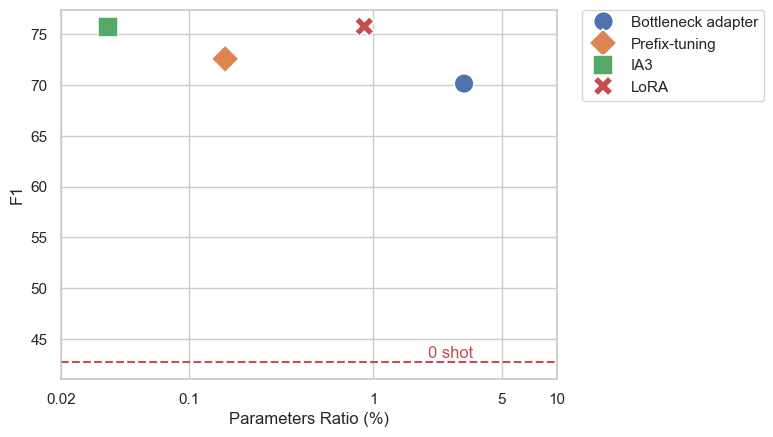

# COS30018-Machine-reading-comprehension
Finetune Google's Flan T5 Large model for MRC task on biomedical domain using CpgQA and CovidQA datasets.

<div align="center">
    
    <p><em>F1 score on CpgQA test set</em></p>
</div>

<div align="center">
    
    <p><em>F1 score on CovidQA test set</em></p>
</div>

Inference application can be found at:
- CpgQA: https://huggingface.co/spaces/legacy107/flan-t5-large-ia3-cpgqa
- CovidQA: https://huggingface.co/spaces/legacy107/flan-t5-large-ia3-covidqa

## Project Structure
- `analysis`: Contains result csv files and charts
- `covidqa`: Notebook used for CovidQA dataset
- `cpgqa`: Notebook used for CpgQA dataset
- `datasets`: Contains the raw datasets
- `inference-application`: The Gradio inference application
- `paraphrasing`: Notebook used for paraphrasing task on BioASQ dataset

## Development Setup
```bash
# Clone the repository and its submodules
git clone https://github.com/Legacy107/COS30018-Machine-reading-comprehension.git
cd COS30018-Machine-reading-comprehension
git submodule init
git submodule update

# Install dependencies
pip install -r requirements.txt

# Install pre-commit hooks
pre-commit install
pre-commit install --hook-type commit-msg
```

## Run the Gradio application
***Note***: The inference application requires around 10GB of RAM to run.
```bash
cd inference-application/flan-t5-large-ia3-cpgqa
# or cd inference-application/flan-t5-large-ia3-covidqa
pip install -r requirements.txt
gradio app.py
```

Alternatively you can run the application using Docker:
```bash
# CpgQA
docker run -it -p 7860:7860 --platform=linux/amd64 \
	registry.hf.space/legacy107-flan-t5-large-ia3-cpgqa:latest python app.py

# CovidQA
docker run -it -p 7860:7860 --platform=linux/amd64 \
	registry.hf.space/legacy107-flan-t5-large-ia3-covidqa:latest python app.py
```
